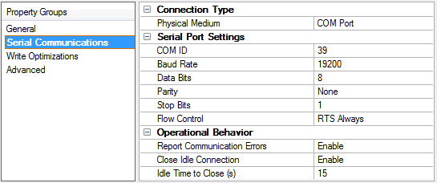

## 가정

rs232 정보가 COM2 포트로 들어온다.

## 요약

1. Kepware에서 COM2로 채널을 만들고(포트/baud 등 설정)
2. 커스텀으로 제작한 장비들 이꺼니깐 U-CON (User-Configurable))로 Device/Tag 생성
3. DataLogger 로 DB 기록

## 선행 작업

1. KEPServerEX 설치 (필요한 드라이버 옵션: Modbus-RTU, U-CON; DataLogger 플러그인)
2. COM2 물리/가상 포트(USB→Serial 어댑터 사용 시 Windows에 COM2로 떠야 함)
   - Kepware에서 해당 COM 포트를 사용하도록 설정
3. DB 접속용 ODBC 드라이버 (Postgresql client)
4. DataLogger 사용을 위해 System DSN으로 설정

## 흐름도

1. Windows에서 COM2 확인(장치관리자 / mode COM2).

2. KEPServerEX에서 Channel 생성
   - Connection Type = COM Port
   - COM ID = COM2
   - Baud/DataBits/Parity/StopBits/Flow Control 중 하나겠지요.
3. Device 추가 (ASCII/바이너리 였던거 같던데 그럼 U-CON 드라이버 선택).
4. Device 내에서 Transaction / Tag 정의
   - U-CON 은 프레임(구분자/길이) 기반임.
   - 필드별로 태그 매핑 가능(Delimiter, Fixed/Variable length 등 지원).
5. 태그값 확인(KEPServerEX Quick Client / OPC UA Quick Client).
6. DataLogger 플러그인으로 ODBC(=System DSN) 연결 설정
   - 로그 그룹 생성
   - Data Map(로그할 태그 선택)
   - 테이블 포맷 & 트리거 설정
   - Start logging.

## 단계별 상세

1. COM2(포트) 확인

   - 장치 관리자(Devmgmt.msc) : Ports (COM & LPT) 에 COM2 확인.
   - 필요시 PuTTY / Serial Port Monitor / mode COM2로 포트가 열리는지, 데이터가 보이는지 확인.

2. KEPServerEX에서 Channel 생성 (COM2 설정)
   - KEPServerEX 구성도에서 우클릭 : New Channel
   - User-Configurable (U-CON) 드라이버 선택
   - Channel - Serial Communications, Channel - Properties
     - Connection Type = COM Port <br />
       
     - COM ID = 2 (COM2)
     - Baud, Data bits, Parity, Stop bits, Flow control 등을 장치 매뉴얼에 맞게 설정. <br/>
       (Flow control은 RS-232↔RS-485 컨버터 사용 시 중요).
3. 저장 — 변경은 런타임에 즉시 적용 가능.<br/>
   Channel 레벨에서 포트 설정(예: baud 등)을 바꾸면,<br/>
   그 채널에 속한 모든 device가 해당 통신 설정을 쓰게 됩니다.
   support.ptc.com

4. Device 생성 — (U-CON)
   - ASCII/바이너리 — U-CON
   - delimiter 사용할것 같음.(메시지종료값).. 기타..고정 길이/길이 필드 등등..
5. U-CON 기본 설정

   - Channel 생성 — COM2 설정.
   - Channel 밑에 New Device → 드라이버로 U-CON 선택 → Device Wizard:
   - Mode: <br />
     Unsolicited (장치가 계속 데이터 푸시) 또는 Solicited <br />
     (KEPServer가 요청해서 응답을 받는 방식) 선택.

   - U-CON의 Transactions 에서 Read Message(적절한 커맨드)를 생성
   - Message 종료 기준으로 읽고 싶으면 Delimiter 를 \n 또는 \r\n 등으로 설정<br />
     (“Parse to next delimiter” 옵션 등 사용).
   - 길이필드가 있으면 Message Length Field 방식 사용. <br />
     Transaction이 읽은 바이트의 offset/length를 지정해서 Tag(STRING/INT/FLOAT 등)로 변환<br />
     (U-CON은 ASCII, ASCII-Hex, Binary 포맷 지원)

6. 설정 저장 → Device online → Quick Client로 값 확인.

```
예시 (장치가 S1,25.7\n 형태로 전송):

Transaction: Read until Delimiter = \n.

Tag1: RAW_STRING := entire frame (ASCII String).

Tag2: SENSOR_ID := substring(1,2) 또는 format으로 분해(예: 첫 2 chars).

Tag3: VALUE := ASCII Real starting at offset (e.g. after comma) — U-CON tag format에서 ASCII Real로 정의, start position 지정.
(구체적 UI 조작은 U-CON Transaction/Tag 속성에서 Start Position, Length, Format을 설정하면 됩니다).
```

## 태그 확인 ( 확인방법 )

1. Quick Client

   - Quick Client(KEPServerEX 내장)로 만들어진 태그들을 브라우즈하고, 값이 들어오는지 확인.

   - PuTTY/Serial Monitor로 COM2에서 실제 바이트가 나오는지 확인. <br />
     주의: 하나의 포트는 한 프로세스만 열 수 있으니 Kepware가 포트를 사용중이면 모니터링 도구로는 중복 오픈 못함.

2. 데이터베이스로 로깅 — DataLogger 플러그인 사용

   - 설정 요약:

   - ODBC 관리자 - System DSN 탭 - Add - Postgresql 드라이버로 DSN 생성
   - KEPServerEX Configuration 트리에서 DataLogger 선택 - Add new Log Group.
   - General 탭 - Configure DSN - 방금 만든 System DSN 선택.

   - Data Map 탭 → Add → 브라우즈해서 로그할 태그 선택<br />
     (예: Device1/RawMessage, Device1/Value 등).

3. Table Selection & Table Format:

   - Table Selection: Create a new table once and always attempt to append to this table 등등 중 선택.
   - Table Format: Narrow <br />
     (딱 하나의 타임스탬프에 여러 태그 열로 들어감). <br />
     <span style="color:red;font-weight:bold">이거 기존에 이걸로 안했을껍니다. 가능하다면 기존꺼 행태로..</span>

4. Trigger: 1000ms... 한주꺼 초단위 받을꺼니깐.<br />
   On Data Change<br />
   아니면 이것도 나쁘지 않음. 장비가 너무 빨리 보내거나 너무 느리게 보내면 문제니깐 <br />
   그때는 trigger 로

5. 확인: DB에서 테이블이 생성되고 데이터가 들어오는지 확인.

DataLogger의 유용 기능: 자동 테이블 생성, Deadband, Store-and-Forward(네트워크/DB 실패 시 디스크에 저장 후 복구 시 전송)
